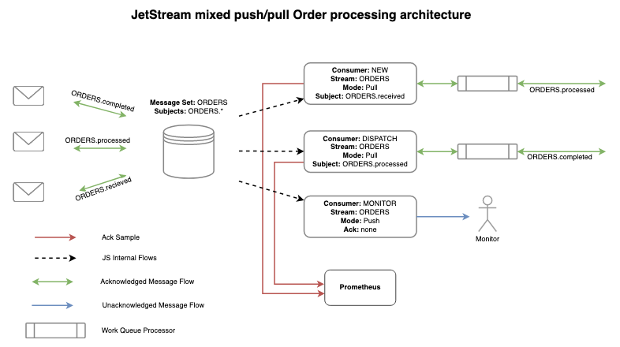

# JetStream (Technical Preview)

JetStream is the [NATS.io](https://nats.io) persistence engine that will support streaming as well as traditional message and worker queues for At-Least-Once delivery semantics.

More information can be found [here](https://nats.io/blog/tech-preview-oct-2019/#jetstream).

# Contents

- [Concepts](#concepts)
  * [Streams](#streams)
  * [Consumers](#consumers)
  * [Configuration](#configuration)
- [Getting Started](#getting-started)
  * [Using Docker](#using-docker)
  * [Using Source](#using-source)
- [Administration and Usage from the CLI](#administration-and-usage-from-the-cli)
  * [Account Information](#account-information)
  * [Streams](#streams-1)
    + [Creating](#creating)
    + [Listing](#listing)
    + [Querying](#querying)
    + [Publishing Into a Stream](#publishing-into-a-stream)
    + [Deleting Data](#deleting-data)
    + [Deleting Sets](#deleting-sets)
  * [Consumers](#consumers-1)
    + [Creating Pull-Based Consumers](#creating-pull-based-consumers)
    + [Creating Push-Based Consumers](#creating-push-based-consumers)
    + [Listing](#listing-1)
    + [Querying](#querying-1)
    + [Consuming Pull-Based Consumers](#consuming-pull-based-consumers)
    + [Consuming Push-Based Consumers](#consuming-push-based-consumers)
- [Model Deep Dive](#model-deep-dive)
  * [Stream Limits and Retention Modes](#stream-limits-and-retention-modes)
  * [Acknowledgement Models](#acknowledgement-models)
  * [Consumer Starting Position](#consumer-starting-position)
  * [Ephemeral Consumers](#ephemeral-consumers)
  * [Consumer Message Rates](#consumer-message-rates)
  * [Ack Sampling](#ack-sampling)
    + [Configuration](#configuration-1)
    + [Consuming](#consuming)
- [NATS API Reference](#nats-api-reference)
  * [Reference](#reference)
  * [Error Handling](#error-handling)
  * [Admin API](#admin-api)
    + [General Info](#general-info)
    + [Streams](#streams-2)
    + [Consumers](#consumers-2)
  * [Acknowledging Messages](#acknowledging-messages)
  * [Fetching The Next Message From a Pull-based Consumer](#fetching-the-next-message-from-a-pull-based-consumer)
  * [Fetching From a Stream By Sequence](#fetching-from-a-stream-by-sequence)
  * [Consumer Samples](#consumer-samples)
- [Next Steps](#next-steps)
- [Discussion Items](#discussion-items)
  * [DLQ (Dead Letter Queue)](#dlq--dead-letter-queue-)
  * [Purge or Truncate (not everything)](#purge-or-truncate--not-everything-)
  * [NAK w/ Duration Before Redelivery](#nak-w--duration-before-redelivery)
  * [MsgSet Immutable?](#msgset-immutable-)
  * [DR/Mirror](#dr-mirror)
  * [Account Template to Auto-create msgSets.](#account-template-to-auto-create-msgsets)
  
## Concepts

In JetStream the configuration for storing messages is defined separately from how they are consumed. Storage is defined in a *Stream* and consuming messages is defined by multiple *Consumers*.

We'll discuss these 2 subjects in the context of this architecture.



While this is an incomplete architecture it does show a number of key points:

 * Many related subjects are stored in a Stream
 * Consumers can have different modes of operation and receive just subsets of the messages
 * Multiple Acknowledgement modes are supported

A new order arrives on `ORDERS.received`, gets sent to the `NEW` Consumer who, on success, will create a new message on `ORDERS.processed`.  The `ORDERS.processed` message again enters the Stream where a `DISPATCH` Consumer receives it and once processed it will create an `ORDERS.completed` message which will again enter the Stream. These operations are all `pull` based meaning they are work queues and can scale horizontally.  All require acknowledged delivery ensuring no order is missed.

All messages are delivered to a `MONITOR` Consumer without any acknowledgement and using Pub/Sub semantics - they are pushed to the monitor.

As messages are acknowledged to the `NEW` and `DISPATCH` Consumers, a percentage of them are Sampled and messages indicating redelivery counts, ack delays and more, are delivered to the monitoring system.

### Streams

Streams define how messages are stored and retention duration.  Streams consume normal NATS subjects, any message found on those subjects will be delivered to the defined storage system. You can do a normal publish to the subject for unacknowledged delivery, else if you send a Request to the subject the JetStream server will reply with an acknowledgement that it was stored.

As of January 2020, in the tech preview we have `file` and `memory` based storage systems, we do not yet support clustering.

In the diagram above we show the concept of storing all `ORDERS.*` in the Stream even though there are many types of order related messages. We'll show how you can selectively consume subsets of messages later. Relatively speaking the Stream is the most resource consuming component so being able to combine related data in this manner is important to consider.

Streams can consume many subjects. Here we have `ORDERS.*` but we could also consume `SHIPPING.state` into the same Stream should that make sense (not shown here).

Streams support various retention policies - they can be kept based on limits like max count, size or age but also more novel methods like keeping them as long as any Consumers have them unacknowledged, or work queue like behavior where a message is removed after first ack.

When defining Streams the items below make up the entire configuration of the set.

|Item|Description|
|----|-----------|
|MaxAge|When retention policy is `StreamPolicy` how old message in the set may be|
|MaxBytes|When retention policy is `StreamPolicy` how big the Stream may be|
|MaxMsgSize|The largest message that will be accepted by the Stream|
|MaxMsgs|When retention policy is `StreamPolicy` how many messages may be in a Stream|
|MaxConsumers|How many Consumers can be defined for a given Stream, `-1` for unlimited|
|Name|A name for the Stream that may not have spaces, tabs or `.`|
|NoAck|Disables acknowledging messages that are received by the Stream|
|Replicas|How many replicas to keep for each message (not implemented as of January 2020)|
|Retention|How message retention is considered, `LimitsPolicy` (default), `InterestPolicy` or `WorkQueuePolicy`|
|Storage|The type of storage backend, `file` and `memory` as of January 2020|
|Subjects|A list of subjects to consume, supports wildcards|

### Consumers

Each Consumer, or related group of Consumers, of a Stream will need an Consumer defined.  It's ok to define thousands of these pointing at the same Stream.

Consumers can either be `push` based where JetStream will deliver the messages as fast as possible to a subject of your choice or `pull` based for typical work queue like behavior. The rate of message delivery in both cases is subject to `ReplayPolicy`.  A `ReplayInstant` Consumer will receive all messages as fast as possible while a `ReplayOriginal` Consumer will receive messages at the rate they were received, which is great for replaying production traffic in staging.

In the orders example above we have 3 Consumers. The first two select a subset of the messages from the Stream by specifying a specific subject like `ORDERS.processed`. The Stream consumes `ORDERS.*` and this allows you to receive just what you need. The final Consumer receives all messages in a `push` fashion.

Consumers track their progress, they know what messages were delivered, acknowledged, etc., and will redeliver messages they sent that were not acknowledged. When first created, the Consumer has to know what message to send as the first one. You can configure either a specific message in the set (`StreamSeq`), specific time (`StartTime`), all (`DeliverAll`) or last (`DeliverLast`).  This is the starting point and from there, they all behave the same - delivering all of the following messages with optional Acknowledgement.

Acknowledgements default to `AckExplicit` - the only supported mode for pull-based Consumers - meaning every message requires distinct acknowledgement.  But for push-based Consumers, you can set `AckNone` that does not require any acknowledgement, or `AckAll` which quite interestingly allows you to acknowledge a specific message, like message `100`, which will also acknowledge messages `1` through `99`. The `AckAll` mode can be a great performance boost.

Some messages may cause your applications to crash and cause a never ending loop forever poisoning your system. The `MaxDeliver` setting allow you to set a upper bound to how many times a message may be delivered.

To assist with creating monitoring applications, one can set a `SampleFrequency` which is a percentage of messages for which the system should sample and create events.  These events will include delivery counts and ack waits.

When defining Consumers the items below make up the entire configuration of the Consumer:

|Item|Description|
|----|-----------|
|AckPolicy|How messages should be acknowledged, `AckNone`, `AckAll` or `AckExplicit`|
|AckWait|How long to allow messages to remain un-acknowledged before attempting redelivery|
|DeliverAll|When first consuming messages start from the first message and deliver every message in the set|
|DeliverLast|When first consuming messages start with the latest received message in the set|
|Delivery|The subject to deliver observed messages, when not set, a pull-based Consumer is created|
|Durable|The name of the Consumer|
|FilterSubject|When consuming from a Stream with many subjects, or wildcards, select only a specific incoming subject|
|MaxDeliver|Maximum amount times a specific message will be delivered.  Use this to avoid poison pills crashing all your services forever|
|StreamSeq|When first consuming messages from the Stream start at this particular message in the set|
|ReplayPolicy|How messages are sent `ReplayInstant` or `ReplayOriginal`|
|SampleFrequency|What percentage of acknowledgements should be samples for observability, 0-100|
|StartTime|When first consuming messages from the Stream start with messages on or after this time|

### Configuration

The rest of this document introduces the `jsm` utility, but for completeness and reference this is how you'd create the ORDERS scenario.  We'll configure a 1 year retention for order related messages:

```bash
$ jsm str add ORDERS --subjects "ORDERS.*" --ack --max-msgs=-1 --max-bytes=-1 --max-age=1y --storage file --retention limits --max-msg-size=-1
$ jsm con add ORDERS NEW --filter ORDERS.received --ack explicit --pull --deliver all --max-deliver=-1 --sample 100
$ jsm con add ORDERS DISPATCH --filter ORDERS.processed --ack explicit --pull --deliver all --max-deliver=-1 --sample 100
$ jsm con add ORDERS MONITOR --filter '' --ack none --target monitor.ORDERS --deliver last --replay instant
```

## Getting Started

This tech preview is limited to a single server and defaults to the global account. JetStream is NATS 2.0 aware and is scoped to accounts from a resource limit perspective. This is not the same as an individual server's resources, but may feel that way starting out. Don't worry, clustering is coming next but we wanted to get input early from the community.

### Using Docker

The `synadia/jsm:latest` docker image contains both the JetStream enabled NATS Server and the `jsm` utility this guide covers.

In one window start JetStream:

```
$ docker run -ti --rm --entrypoint /nats-server --name js synadia/jsm:latest -js -D
```

And in another log into the utilities:

```
$ docker exec -ti -e NATS_URL=localhost js sh -l
```

This shell has the `jsm` utility and all other NATS cli tools used in the rest of this guide.

Now skip to the `Administer JetStream` section.

### Using Source

You will also want to have installed from the nats.go repo the examples/tools such as nats-pub, nats-sub, nats-req and possibly nats-bench. One of the design goals of JetStream was to be native to core NATS, so even though we will most certainly add in syntactic sugar to clients to make them more appealing, for this tech preview we will be using plain old NATS.

You will need a copy of the nats-server source locally and will need to be in the jetstream branch.

```
$ git clone https://github.com/nats-io/nats-server.git
$ cd nats-server
$ git checkout jetstream
$ go build
$ ls -l nats-server
```

Starting the server you can use the `-js` flag. This will setup the server to reasonably use memory and disk. This is a sample run on my machine. JetStream will default to 1TB of disk and 75% of available memory for now.

```
$ ./nats-server -js

[16928] 2019/12/04 19:16:29.596968 [INF] Starting nats-server version 2.2.0-beta
[16928] 2019/12/04 19:16:29.597056 [INF] Git commit [not set]
[16928] 2019/12/04 19:16:29.597072 [INF] Starting JetStream
[16928] 2019/12/04 19:16:29.597444 [INF] ----------- JETSTREAM (Beta) -----------
[16928] 2019/12/04 19:16:29.597451 [INF]   Max Memory:      96.00 GB
[16928] 2019/12/04 19:16:29.597454 [INF]   Max Storage:     1.00 TB
[16928] 2019/12/04 19:16:29.597461 [INF]   Store Directory: "/var/folders/m0/k03vs55n2b54kdg7jm66g27h0000gn/T/jetstream"
[16928] 2019/12/04 19:16:29.597469 [INF] ----------------------------------------
[16928] 2019/12/04 19:16:29.597732 [INF] Listening for client connections on 0.0.0.0:4222
[16928] 2019/12/04 19:16:29.597738 [INF] Server id is NAJ5GKP5OBVISP5MW3BFAD447LMTIOAHFEWMH2XYWLL5STVGN3MJHTXQ
[16928] 2019/12/04 19:16:29.597742 [INF] Server is ready
```

You can override the storage directory if you want.

```
$ ./nats-server -js -sd /tmp/test

[16943] 2019/12/04 19:20:00.874148 [INF] Starting nats-server version 2.2.0-beta
[16943] 2019/12/04 19:20:00.874247 [INF] Git commit [not set]
[16943] 2019/12/04 19:20:00.874273 [INF] Starting JetStream
[16943] 2019/12/04 19:20:00.874605 [INF] ----------- JETSTREAM (Beta) -----------
[16943] 2019/12/04 19:20:00.874613 [INF]   Max Memory:      96.00 GB
[16943] 2019/12/04 19:20:00.874615 [INF]   Max Storage:     1.00 TB
[16943] 2019/12/04 19:20:00.874620 [INF]   Store Directory: "/tmp/test/jetstream"
[16943] 2019/12/04 19:20:00.874625 [INF] ----------------------------------------
[16943] 2019/12/04 19:20:00.874868 [INF] Listening for client connections on 0.0.0.0:4222
[16943] 2019/12/04 19:20:00.874874 [INF] Server id is NCR6KDDGWUU2FXO23WAXFY66VQE6JNWVMA24ALF2MO5GKAYFIMQULKUO
[16943] 2019/12/04 19:20:00.874877 [INF] Server is ready
```

## Administration and Usage from the CLI

Once the server is running it's time to use the management tool. This can be downloaded from the [GitHub Release Page](https://github.com/nats-io/jetstream/releases/) or you can use the `synadia/jsm:latest` docker image.

```
$ jsm --help
usage: jsm [<flags>] <command> [<args> ...]
JetStream Management Tool

Flags:
      --help                     Show context-sensitive help (also try --help-long and --help-man).
      --version                  Show application version.
  -s, --server="localhost:4222"  NATS servers
      --creds=CREDS              User credentials
      --tlscert=TLSCERT          TLS public certifcate
      --tlskey=TLSKEY            TLS private key
      --tlsca=TLSCA              TLS certifcate authority chain
      --timeout=2s               Time to give JetStream to respond to queries

Commands:
  help [<command>...]
    Show help.
 ...
```

We'll walk through the above scenario and introduce features of the CLI and of JetStream as we recreate the setup above.

Throughout this example, we'll show other commands like `nats-pub` and `nats-sub` to interact with the system. These are normal existing core NATS commands and JetStream is fully usable by only using core NATS.

We'll touch on some additional features but please review the section on the design model to understand all possible permutations.

### Account Information

JetStream is multi-tenant so you will need to check that your account is enabled for JetStream and is not limited. You can view your limits as follows:

```nohighlight
$ jsm account info

      Memory: 0 B of 6.4 GB
     Storage: 0 B of 1.1 TB
     Streams: 1 of Unlimited
```

### Streams

The first step is to set up storage for our `ORDERS` related messages, these arrive on a wildcard of subjects all flowing into the same Stream and they are kept for 1 year.

#### Creating

```nohighlight
$ jsm str add ORDERS
? Subjects to consume ORDERS.*
? Storage backend file
? Retention Policy Limits
? Message count limit -1
? Message size limit -1
? Maximum message age limit 1y
? Maximum individual message size [? for help] (-1) -1
Stream ORDERS was created

Information for Stream ORDERS

Configuration:

             Subjects: ORDERS.*
  No Acknowledgements: false
            Retention: File - Limits
             Replicas: 1
     Maximum Messages: -1
        Maximum Bytes: -1
          Maximum Age: 8760h0m0s
 Maximum Message Size: -1
  Maximum Consumers: -1

Statistics:

            Messages: 0
               Bytes: 0 B
            FirstSeq: 0
             LastSeq: 0
    Active Consumers: 0
```

You can get prompted interactively for missing information as above, or do it all on one command. Pressing `?` in the CLI will help you map prompts to CLI options:

```
$ jsm str add ORDERS --subjects "ORDERS.*" --ack --max-msgs=-1 --max-bytes=-1 --max-age=1y --storage file --retention limits --max-msg-size=-1
```

#### Listing

We can confirm our Stream was created:

```nohighlight
$ jsm str ls
Streams:

	ORDERS
```

#### Querying

Information about the configuration of the Stream can be seen, and if you did not specify the Stream like below, it will prompt you based on all known ones:

```nohighlight
$ jsm str info ORDERS
Information for Stream ORDERS

Configuration:

             Subjects: ORDERS.*
  No Acknowledgements: false
            Retention: File - Limits
             Replicas: 1
     Maximum Messages: -1
        Maximum Bytes: -1
          Maximum Age: 8760h0m0s
    Maximum Consumers: -1

Statistics:

            Messages: 0
               Bytes: 0 B
            FirstSeq: 0
             LastSeq: 0
    Active Consumers: 0
```

Most commands that show data as above support `-j` to show the results as JSON:

```nohighlight
$ jsm str info ORDERS -j
{
  "config": {
    "name": "ORDERS",
    "subjects": [
      "ORDERS.*"
    ],
    "retention": "limits",
    "max_consumers": -1,
    "max_msgs": -1,
    "max_bytes": -1,
    "max_age": 31536000000000000,
    "storage": "file",
    "num_replicas": 1
  },
  "stats": {
    "messages": 0,
    "bytes": 0,
    "first_seq": 0,
    "last_seq": 0,
    "consumer_count": 0
  }
}
```

This is the general pattern for the entire `jsm` utility - prompting for needed information but every action can be run non-interactively making it usable as a cli api. All information output like seen above can be turned into JSON using `-j`.

#### Publishing Into a Stream

Now let's add in some messages to our Stream. You can use `nats-pub` or `nats-bench`. Or even `nats-req` to see the publish ack being returned (these are included in the `synadia/jsm:latest` docker image).

You can publish without waiting for acknowledgement:

```nohighlight
$ nats-pub ORDERS.scratch hello
Published [sub1] : 'hello'
```

But if you want to be sure your messages got to JetStream and were persisted you can make a request:

```nohighlight
$ nats-req ORDERS.scratch hello
+OK
```

Keep checking the status of the Stream while doing this and you'll see it's stored messages increase.

```nohighlight
$ jsm str info ORDERS
Information for Stream ORDERS
...
Statistics:

            Messages: 3
               Bytes: 147 B
            FirstSeq: 1
             LastSeq: 3
    Active Consumers: 0
```

After putting some throw away data into the Stream, we can purge all the data out - while keeping the Stream active:

#### Deleting Data

```nohighlight
$ jsm str purge ORDERS -f
...
Statistics:

            Messages: 0
               Bytes: 0 B
            FirstSeq: 1,000,001
             LastSeq: 1,000,000
    Active Consumers: 0
```

#### Deleting Sets

Finally for demonstration purposes, you can also delete the whole Stream and recreate it so then we're ready for creating the Consumers:

```
$ jsm str rm ORDERS -f
$ jsm str add ORDERS --subjects "ORDERS.*" --ack --max-msgs=-1 --max-bytes=-1 --max-age=1y --storage file --retention limits --max-msg-size=-1
```

### Consumers

Consumers is how messages are read or consumed from the Stream. We support pull and push-based Consumers and the example scenario has both, lets walk through that.

#### Creating Pull-Based Consumers

The `NEW` and `DISPATCH` Consumers are pull-based, meaning the services consuming data from them have to ask the system for the next available message.  This means you can easily scale your services up by adding more workers and the messages will get spread across the workers based on their availability.

Pull-based Consumers are created the same as push-based Consumers, just don't specify a delivery target.

```
$ jsm con ls ORDERS
No Consumers defined
```

We have no Consumers, lets add the `NEW` one:

I supply the `--sample` options on the CLI as this is not prompted for at present, everything else is prompted. The help in the CLI explains each:

```
$ jsm con add --sample 100
? Select a Stream ORDERS
? Consumer name NEW
? Delivery target
? Start policy (all, last, 1h, msg sequence) all
? Filter Stream by subject (blank for all) ORDERS.received
? Maximum Allowed Deliveries 20
Information for Consumer ORDERS > NEW

Configuration:

        Durable Name: NEW
           Pull Mode: true
             Subject: ORDERS.received
         Deliver All: true
        Deliver Last: false
          Ack Policy: explicit
            Ack Wait: 30s
       Replay Policy: instant
  Maximum Deliveries: 20
       Sampling Rate: 100

State:

  Last Delivered Message: Consumer sequence: 1 Stream sequence: 1
    Acknowledgment floor: Consumer sequence: 0 Stream sequence: 0
        Pending Messages: 0
    Redelivered Messages: 0
```

This is a pull-based Consumer (empty Delivery Target), it gets messages from the first available message and requires specific acknowledgement of each and every message.

It only received messages that originally entered the Stream on `ORDERS.received`. Remember the Stream subscribes to `ORDERS.*`, this lets us select a subset of messages from the Stream.
 
A Maximum Delivery limit of 20 is set, this means if the message is not acknowledged it will be retried but only up to this maximum total deliveries.

Again this can all be done in a single CLI call, lets make the `DISPATCH` Consumer:

```
$ jsm con add ORDERS DISPATCH --filter ORDERS.processed --ack explicit --pull --deliver all --sample 100 --max-deliver 20
```

#### Creating Push-Based Consumers

Our `MONITOR` Consumer is push-based, has no ack and will only get new messages and is not sampled:

```
$ jsm con add
? Select a Stream ORDERS
? Consumer name MONITOR
? Delivery target monitor.ORDERS
? Start policy (all, last, 1h, msg sequence) last
? Acknowledgement policy none
? Replay policy instant
? Filter Stream by subject (blank for all)
? Maximum Allowed Deliveries -1
Information for Consumer ORDERS > MONITOR

Configuration:

      Durable Name: MONITOR
  Delivery Subject: monitor.ORDERS
       Deliver All: false
      Deliver Last: true
        Ack Policy: none
     Replay Policy: instant

State:

  Last Delivered Message: Consumer sequence: 1 Stream sequence: 3
    Acknowledgment floor: Consumer sequence: 0 Stream sequence: 2
        Pending Messages: 0
    Redelivered Messages: 0
```

Again you can do this with a single non interactive command:

```
$ jsm con add ORDERS MONITOR --ack none --target monitor.ORDERS --deliver last --replay instant --filter ''
```

#### Listing

You can get a quick list of all the Consumers for a specific Stream:

```
$ jsm con ls ORDERS
Consumers for Stream ORDERS:

        DISPATCH
        MONITOR
        NEW
```

#### Querying

All details for an Consumer can be queried, lets first look at a pull-based Consumer:

```
$ jsm con info ORDERS DISPATCH
Information for Consumer ORDERS > DISPATCH

Configuration:

      Durable Name: DISPATCH
         Pull Mode: true
           Subject: ORDERS.processed
       Deliver All: true
      Deliver Last: false
        Ack Policy: explicit
          Ack Wait: 30s
     Replay Policy: instant
     Sampling Rate: 100

State:

  Last Delivered Message: Consumer sequence: 1 Stream sequence: 1
    Acknowledgment floor: Consumer sequence: 0 Stream sequence: 0
        Pending Messages: 0
    Redelivered Messages: 0
```

More details about the `State` section will be shown later when discussing the ack models in depth.

#### Consuming Pull-Based Consumers

Pull-based Consumers require you to specifically ask for messages and ack them, typically you would do this with the client library `Request()` feature, but the `jsm` utility has a helper:

First we ensure we have a message:

```
$ nats-pub ORDERS.processed "order 1"
$ nats-pub ORDERS.processed "order 2"
$ nats-pub ORDERS.processed "order 3"
```

We can now read them using `jsm`:

```
$ jsm con next ORDERS DISPATCH
--- received on ORDERS.processed
order 1

Acknowledged message

$ jsm con next ORDERS DISPATCH
--- received on ORDERS.processed
order 2

Acknowledged message
```

You can prevent ACKs by supplying `--no-ack`.

To do this from code you'd send a `Request()` to `$JS.NEXT.ORDERS.DISPATCH`:

```
$ nats-req '$JS.NEXT.ORDERS.DISPATCH' ''
Published [$JS.NEXT.ORDERS.DISPATCH] : ''
Received  [ORDERS.processed] : 'order 3'
```

Here `nats-req` cannot ack, but in your code you'd respond to the received message with a nil payload as an Ack to JetStream.

#### Consuming Push-Based Consumers

Push-based Consumers will publish messages to a subject and anyone who subscribes to the subject will get them, they support different Acknowledgement models covered later, but here on the `MONITOR` Consumer we have no Acknowledgement.

```
$ jsm con info ORDERS MONITOR
...
  Delivery Subject: monitor.ORDERS
...
```

The Consumer is publishing to that subject, so lets listen there:

```
$ nats-sub monitor.ORDERS
Listening on [monitor.ORDERS]
[#3] Received on [ORDERS.processed]: 'order 3'
[#4] Received on [ORDERS.processed]: 'order 4'
```

Note the subject here of the received message is reported as `ORDERS.processed` this helps you distinguish what you're seeing in a Stream covering a wildcard, or multiple subject, subject space.

This Consumer needs no ack, so any new message into the ORDERS system will show up here in real time.

## Model Deep Dive

The Orders example touched on a lot of features, but some like different Ack models and message limits, need a bit more detail. This section will expand on the above and fill in some blanks.

### Stream Limits and Retention Modes

Streams store data on disk, but we cannot store all data forever so we need ways to control their size automatically.

There are 3 features that come into play when Streams decide how long they store data.

The `Retention Policy` describes based on what criteria a set will evict messages from its storage:

|Retention Policy|Description|
|----------------|-----------|
|`LimitsPolicy`  |Limits are set for how many messages, how big the storage and how old messages may be|
|`WorkQueuePolicy`|Messages are kept until they were consumed by any one single observer and then removed|
|`InterestPolicy`|Messages are kept as long as there are Consumers active for them|

In all Retention Policies the basic limits apply as upper bounds, these are `MaxMsgs` for how many messages are kept in total, `MaxBytes` for how big the set can be in total and `MaxAge` for what is the oldest message that will be kept. These are the only limits in play with `StreamPolicy` retention.

One can then define additional ways a message may be removed from the Stream earlier than these limits.  In `WorkQueuePolicy` the messages will be removed as soon as any Consumer received an Acknowledgement. In `InterestPolicy` messages will be removed as soon as there are no more Consumers.

In both `WorkQueuePolicy` and `InterestPolicy` the age, size and count limits will still apply as upper bounds.

A final control is the Maximum Size any single message may have. NATS have it's own limit for maximum size (1 MiB by default), but you can say a Stream will only accept messages up to 1024 bytes using `MaxMsgSize`.

### Acknowledgement Models

Streams support acknowledging receiving a message, if you send a `Request()` to a subject covered by the configuration of the Stream the service will reply to you once it stored the message.  If you just publish, it will not. A Stream can be set to disable Acknowledgements by setting `NoAck` to `true` in it's configuration.

Consumers have 3 acknowledgement modes:

|Mode|Description|
|----|-----------|
|`AckExplicit`|This requires every message to be specifically acknowledged, it's the only supported option for pull-based Consumers|
|`AckAll`|In this mode if you acknowledge message `100` it will also acknowledge message `1`-`99`, this is good for processing batches and to reduce ack overhead|
|`AckNone`|No acknowledgements are supported|

To understand how Consumers track messages we will start with a clean `ORDERS` Stream and `DISPATCH` Consumer.

```
$ jsm str info ORDERS
...
Statistics:

            Messages: 0
               Bytes: 0 B
            FirstSeq: 0
             LastSeq: 0
    Active Consumers: 1
```

The Set is entirely empty

```
$ jsm con info ORDERS DISPATCH
...
State:

  Last Delivered Message: Consumer sequence: 1 Stream sequence: 1
    Acknowledgment floor: Consumer sequence: 0 Stream sequence: 0
        Pending Messages: 0
    Redelivered Messages: 0
```

The Consumer has no messages oustanding and has never had any (Consumer sequence is 1).

We publish one message to the Stream and see that the Stream received it:

```
$ nats-pub ORDERS.processed "order 4"
Published [ORDERS.processed] : 'order 4'
$ jsm str info ORDERS
...
Statistics:

            Messages: 1
               Bytes: 53 B
            FirstSeq: 1
             LastSeq: 1
    Active Consumers: 1
```

As the Consumer is pull-based, we can fetch the message, ack it, and check the Consumer state:

```
$ jsm con next ORDERS DISPATCH
--- received on ORDERS.processed
order 4

Acknowledged message

$ jsm con info ORDERS DISPATCH
...
State:

  Last Delivered Message: Consumer sequence: 2 Stream sequence: 2
    Acknowledgment floor: Consumer sequence: 1 Stream sequence: 1
        Pending Messages: 0
    Redelivered Messages: 0
```

The message got delivered and acknowledged - `Acknowledgement floor` is `1` and `1`, the sequence of the Consumer is `2` which means its had only the one message through and got acked. Since it was acked, nothing is pending or redelivering.

We'll publish another message, fetch it but not Ack it this time and see the status:

```
$ nats-pub ORDERS.processed "order 5"
Published [ORDERS.processed] : 'order 5'

$ jsm con next ORDERS DISPATCH --no-ack
--- received on ORDERS.processed
order 5

$ jsm con info ORDERS DISPATCH
State:

  Last Delivered Message: Consumer sequence: 3 Stream sequence: 3
    Acknowledgment floor: Consumer sequence: 1 Stream sequence: 1
        Pending Messages: 1
    Redelivered Messages: 0
```

Now we can see the Consumer have processed 2 messages (obs sequence is 3, next message will be 3) but the Ack floor is still 1 - thus 1 message is pending acknowledgement. Indeed this is confirmed in the `Pending messages`.

If I fetch it again and again do not ack it:

```
$ jsm con next ORDERS DISPATCH --no-ack
--- received on ORDERS.processed
order 5

$ jsm con info ORDERS DISPATCH
State:

  Last Delivered Message: Consumer sequence: 4 Stream sequence: 3
    Acknowledgment floor: Consumer sequence: 1 Stream sequence: 1
        Pending Messages: 1
    Redelivered Messages: 1
```

The Consumer sequence increases - each delivery attempt increase the sequence - and our redelivered count also goes up.

Finally if I then fetch it again and ack it this time:

```
$ jsm con next ORDERS DISPATCH 
--- received on ORDERS.processed
order 5

Acknowledged message
$ jsm con info ORDERS DISPATCH
State:

  Last Delivered Message: Consumer sequence: 5 Stream sequence: 3
    Acknowledgment floor: Consumer sequence: 1 Stream sequence: 1
        Pending Messages: 0
    Redelivered Messages: 0
```

Having now Acked the message there are no more pending.

### Consumer Starting Position

When setting up an Consumer you can decide where to start, the system supports the following:

|Policy|Description|
|------|-----------|
|`DeliverAll`|Delivers all messages that are available|
|`DeliverLast`|Delivers the latest message, like a `tail -f`|
|`MsgSetSeq`|Delivers from a specific message in a Stream and newer|
|`StartTime`|Delivers from a specific time, where the time is a delta from now|

Regardless of what mode you set, this is only the starting point. Once started it will always give you what you have not seen or acknowledged. So this is merely how it picks the very first message.

Lets look at each of these, first we make a new Stream `ORDERS` and add 100 messages to it.

Now create a `DeliverAll` pull-based Consumer:

```
$ jsm con add ORDERS ALL --pull --filter ORDERS.processed --ack none --replay instant --deliver all 
$ jsm con next ORDERS ALL
--- received on ORDERS.processed
order 1

Acknowledged message
```

Now create a `DeliverLast` pull-based Consumer:

```
$ jsm con add ORDERS LAST --pull --filter ORDERS.processed --ack none --replay instant --deliver last
$ jsm con next ORDERS LAST
--- received on ORDERS.processed
order 100

Acknowledged message
``` 

Now create a `MsgSetSeq` pull-based Consumer:

```
$ jsm con add ORDERS TEN --pull --filter ORDERS.processed --ack none --replay instant --deliver 10
$ jsm con next ORDERS TEN
--- received on ORDERS.processed
order 10

Acknowledged message
```

And finally a time-based Consumer. Let's add some messages a minute apart:

```
$ jsm str purge ORDERS
$ for i in 1 2 3
do
  nats-pub ORDERS.processed "order ${i}"
  sleep 60
done
```

Then create an Consumer that starts 2 minutes ago:

```
$ jsm con add ORDERS 2MIN --pull --filter ORDERS.processed --ack none --replay instant --deliver 2m
$ jsm con next ORDERS 2MIN
--- received on ORDERS.processed
order 2

Acknowledged message
```

### Ephemeral Consumers

So far, all the Consumers you have seen were Durable, meaning they exist even after you disconnect from JetStream. In our Orders scenario, though the `MONITOR` Consumer could very well be a short-lived thing there just while an operator is debugging the system, there is no need to remember the last seen position if all you are doing is wanting to observe the real-time state.

In this case, we can make an Ephemeral Consumer by first subscribing to the delivery subject, then creating a durable and giving it no durable name.  An Ephemeral Consumer exists as long as any subscription is active on its delivery subject. It is automatically be removed, after a short grace period to handle restarts, when there are no subscribers.

Ephemeral Consumers can only be push-based.

Terminal 1:

```
$ nats-sub my.monitor
```

Terminal 2:

```
$ jsm con add ORDERS --filter '' --ack none --target 'my.monitor' --deliver last --replay instant --ephemeral
```

The `--ephemeral` switch tells the system to make an Ephemeral Consumer.

### Consumer Message Rates

Typically what you want is if a new Consumer is made the selected messages are delivered to you as quickly as possible. You might want to replay messages at the rate they arrived though, meaning if messages first arrived 1 minute apart and you make a new Consumer it will get the messages a minute apart.

This is useful in load testing scenarios etc. This is called the `ReplayPolicy` and have values of `ReplayInstant` and `ReplayOriginal`.

You can only set `ReplayPolicy` on push-based Consumers.

```
$ jsm con add ORDERS REPLAY --target out.original --filter ORDERS.processed --ack none --deliver all --sample 100 --replay original
...
     Replay Policy: original
...
```

Now lets publish messages into the Set 10 seconds apart:

```
$ for i in 1 2 3                                                                                                                                                      <15:15:35
do
  nats-pub ORDERS.processed "order ${i}"
  sleep 10
done
Published [ORDERS.processed] : 'order 1'
Published [ORDERS.processed] : 'order 2'
Published [ORDERS.processed] : 'order 3'
```

And when we consume them they will come to us 10 seconds apart:

```
$ nats-sub -t out.original
Listening on [out.original]
2020/01/03 15:17:26 [#1] Received on [ORDERS.processed]: 'order 1'
2020/01/03 15:17:36 [#2] Received on [ORDERS.processed]: 'order 2'
2020/01/03 15:17:46 [#3] Received on [ORDERS.processed]: 'order 3'
^C
```

### Ack Sampling

In the earlier sections we saw that samples are being sent to a monitoring system. Let's look at that in depth; how the monitoring system works and what it contains.

As messages pass through an Consumer you'd be interested in knowing how many are being redelivered and how many times but also how long it takes for messages to be acknowledged.

Consumers can sample Ack'ed messages for you and publish samples so your monitoring system can observe the health of an Consumer. We will add support for this to [NATS Surveyor](https://github.com/nats-io/nats-surveyor).

#### Configuration

You can configure an Consumer for sampling by passing the `--sample 80` option to `jsm obs add`, this tells the system to sample 80% of Acknowledgements.

When viewing info of an Consumer you can tell if it's sampled or not:

```
$ jsm con info ORDERS NEW
...
     Sampling Rate: 100
...
```

#### Consuming

Samples are published to `$JS.CONSUMER.ACKSAMPLE.<stream name>.<consumer name>` in JSON format containing `server.ConsumerAckEvent`. Use the `jsm con sample` command to view samples:

```nohighlight
$ jsm con sample
? Select a Stream ORDERS
? Select an Consumer NEW
Listening for Ack Samples on $JS.CONSUMER.ACKSAMPLE.ORDERS.NEW with sampling frequency 100 for ORDERS > NEW 

[16:10:13] ORDERS > NEW
  Stream Sequence: 142
   Consumer Sequence: 154
           Redelivered: 1
                 Delay: 5.1684ms
```

```nohighlight
$ jsm con sample ORDERS NEW --json
{
  "stream": "ORDERS",
  "consumer": "NEW",
  "consumer_seq": 155,
  "stream_seq": 143,
  "ack_time": 5387000,
  "delivered": 1
}
{
  "stream": "ORDERS",
  "consumer": "NEW",
  "consumer_seq": 156,
  "stream_seq": 144,
  "ack_time": 5807800,
  "delivered": 1
}
```

## NATS API Reference

Thus far we saw a lot of CLI interactions. The CLI works by sending and receiving specially crafted messages over core NATS to configure the JetStream system. In time we will look to add file based configuration but for now the only method is the NATS API.

### Reference

All of these subjects are found as constants in the NATS Server source, so for example the `$JS.STREAMS` is a constant in the nats-server source `server.JetStreamStreams`. The tables below will reference these constants and likewise data structures in the server for payloads.

### Error Handling

Many API calls that do not have specific structured data as response will reply with either `+OK` or `-ERR <reason>`, in the reference below this is what is known as `Standard OK/ERR`. Even those that reply with JSON structures can reply with `-ERR <reason>` instead of the expected JSON, so you need to check for that first before attempting to parse the result.

```nohighlight
$ nats-req '$JS.STREAM.INFO' nonexisting
Published [$JS.STREAM.INFO] : 'nonexisting'
Received  [_INBOX.lcWgjX2WgJLxqepU0K9pNf.mpBW9tHK] : '-ERR stream not found'
```

```nohighlight
$ nats-req '$JS.STREAM.INFO' ORDERS
Published [$JS.STREAM.INFO] : 'ORDERS'
Received  [_INBOX.fwqdpoWtG8XFXHKfqhQDVA.vBecyWmF] : '{
  "config": {
    "name": "ORDERS",
  ...
}
```

### Admin API

All the admin actions the `jsm` CLI can do falls in the sections below.

#### General Info

|subject|Description|Request Payload|Response Payload|
|-----|-----------|---------------|----------------|
|`server.JetStreamEnabled`|Determines if JetStream is enabled for your account|empty payload|`+OK` else no response|
|`server.JetStreamInfo`|Retrieves stats and limits about your account|empty payload|`server.JetStreamAccountStats`

#### Streams

|subject|Description|Request Payload|Response Payload|
|-----|-----------|---------------|----------------|
|`server.JetStreamStreams`|List known Streams|empty payload|Array of names in JSON format|
|`server.JetStreamCreateStream`|Creates a new Stream|`server.StreamConfig`|Standard OK/ERR|
|`server.JetStreamStreamInfo`|Information about config and state of a Stream|name of the Stream|`server.StreamInfo`|
|`server.JetStreamDeleteStream`|Deletes a Stream and all its data|name of the Stream|Standard OK/ERR|
|`server.JetStreamPurgeStream`|Purges all of the data in a Stream, leaves the Stream|name of the Message sSet|Standard OK/ERR|
|`server.JetStreamDeleteMsg`|Deletes a specific message in the Stream by sequence, useful for GDPR compliance|`stream_name stream_seq`|Standard OK/ERR|

#### Consumers

|subject|Description|Request Payload|Response Payload|
|-----|-----------|---------------|----------------|
|`server.JetStreamConsumers`|List known Consumers|name of the Stream|Array of names in JSON format|
|`server.JetStreamCreateConsumer`|Create an Consumer|`server.ConsumerConfig`|Standard OK/ERR|
|`server.JetStreamConsumerInfo`|Information about an Consumer|`stream_name consumer_name`|`server.ConsumerInfo`|
|`server.JetStreamDeleteConsumer`|Deletes an Consumer|`stream_name consumer_name`|Standard OK/ERR|

### Acknowledging Messages

Messages that need acknowledgement will have a Reply subject set, something like `$JS.A.ORDERS.test.1.2.2`, this is the prefix defined in `server.JetStreamAckPre` followed by `<stream>.<consumer>.<delivered count>.<stream sequence>.<stream sequence>`.

In all the Synadia maintained API's you can simply do `msg.Respond(nil)` (or language equivalent) which will send nil to the reply subject.

### Fetching The Next Message From a Pull-based Consumer

If you have a pull-based Consumer you can send a standard NATS Request to `$JS.NEXT.<stream>.<consumer>`, here the prefix is defined in `server.JetStreamRequestNextPre`.

```nohighlight
$ nats-req '$JS.NEXT.ORDERS.test' '1'
Published [$JS.NEXT.ORDERS.test] : '1'
Received  [js.1] : 'message 1'
```

Here we ask for just 1 message - `nats-req` only shows 1 - but you can fetch a batch of messages by varying the argument. This combines well with the `AckAll` Ack policy.

### Fetching From a Stream By Sequence

If you know the Stream sequence of a message you can fetch it directly, this does not support acks.  Do a Request() to `$JS.BYSEQ.ORDERS` sending it the message sequence as payload.  Here the prefix is defined in `server.JetStreamMsgBySeqPre`.

```nohighlight
$ nats-req '$JS.BYSEQ.ORDERS' '1'
Published [$JS.BYSEQ.ORDERS] : '1'
Received  [_INBOX.cJrbzPJfZrq8NrFm1DsZuH.k91Gb4xM] : '{
  "Subject": "js.1",
  "Data": "MQ==",
  "Time": "2020-01-02T16:37:14.5611093Z"
}'
```

The Subject shows where the message was received, Data is base64 encoded and Time is when it was received.

### Consumer Samples

Samples are published to a specific subject per Consumer, something like `$JS.CONSUMER.ACKSAMPLE.<stream>.<consumer name>` you can just subscribe to that and get `server.ConsumerAckEvent` messages in JSON format.  The prefix is defined in `server.JetStreamConsumerAckSamplePre`.

## Next Steps

There is plenty more to discuss and features to describe. We will continue to add information to this document and feel free to post any questions on the JetStream Slack channel. For the brave, take a look at `nats-server/test/jetstream_test.go` for all that JetStream can do. And please file any issues or communicate on [Slack](https://slack.nats.io) or by email <info@nats.io>.

Next up is a deep dive into the clustering implementation which will be completed before an official beta. The design has been ongoing since the beginning of coding but I wanted to get this out to the community to gather feedback and additional input.

## Discussion Items

There a few items we are still considering/thinking about and would love the community's input. In no particular order.

### DLQ (Dead Letter Queue)
Do we need or desire these? JetStream separates Streams (producing, retaining and ordering) from the Consumers (consumption). We do indicate the amount of times a message has been delivered and at least it may make sense when creating an Consumer to set a maximum for number of delivery attempts. Once that is reached however it is not clear what to do with the message. If the Stream is limit-based retention, the message will still be there for an admin to create an Consumer and take a look.

### Purge or Truncate (not everything)
We offer purge but that deletes all messages from a Stream. Wondering of you may want to truncate. This is if no message or byte limits were set.

### NAK w/ Duration Before Redelivery
Should we allow a time duration to be optionally sent with a NAK to say "do not attempt a redelivery for delta time"

### MsgSet Immutable?
Streams are always hashed and each message is hashed with sequence number and timestamp. However we do allow the ability to securely delete messages. Should we also allow the creator of a Stream to specify the set is strictly immutable? I had this programmed before where each message hash included the hash from the previous message, making the whole set tamper proof.

### DR/Mirror
We will add the ability to mirror a Stream from one cluster to the next. Just need to think this through.

### Account Template to Auto-create msgSets.
As we start to directly instrument accounts with JetStream limits etc., should we also allow a subject space that is not directly assigned to a Stream but creates a template for the system to auto-create Streams. Question is, should we auto-delete them as well, like STAN does?
