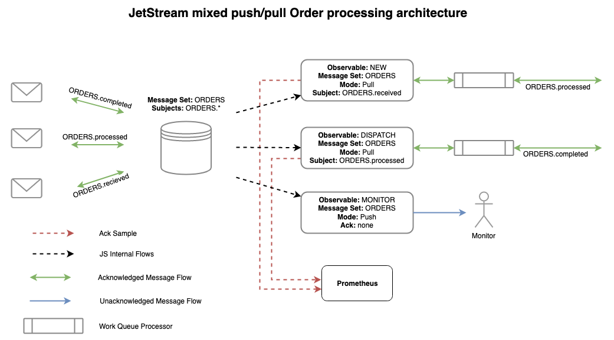

# JetStream (Technical Preview)

JetStream is the [NATS.io](https://nats.io) persistence engine that will support streaming as well as traditional message and worker queues for At-Least-Once delivery semantics.

More information can be found [here](https://nats.io/blog/tech-preview-oct-2019/#jetstream).

## Concepts

In JetStream the configuration for storing messages is defined separately from how they are consumed. Storage is defined in a *Message Set* and consuming messages is defined by multiple *Observables*.

We'll discuss these 2 topics in the context of this architecture.



While this is an incomplete architecture it does show a number of key points:

 * Many related topics are stored in a Message Set
 * Observables can have different modes of operation and receive just subsets of the messages
 * Multiple Acknowledgement modes are supported

A new order arrives on `ORDERS.received`, gets sent to the `NEW` Observable who, on success, will create a new message on `ORDERS.processed`.  The `ORDERS.processed` message again enters the store where a `DISPATCH` Observable receives it and once processed it will create a `ORDERS.completed` message which will again enter the Message Set. These operations are all `pull` based meaning they are work queues and can scale horizontally.  All require acknowledged delivery ensuring no order is missed.

All messages are delivered to a `MONITOR` Observable without any acknowledgement and using Pub/Sub semantics - they are pushed to the monitor.

### Message Sets

Message Sets define how messages are stored and how long they are kept for.  Message Sets consume normal NATS topics, any message found on those topics will be delivered to the defined storage system. You can do a normal publish to the topic for unacknowledged delivery, else if you send a Request to the topic the JetStream server will reply with an acknowledgement that it was stored.

Today in the tech preview we have `file` and `memory` based storage systems, we do not yet support clustering.

In the diagram above we show the concept of storing all `ORDERS.*` in the Message Set even though there are many types of order related message. We'll show how you can selectively consume subsets of messages later. Relatively speaking the Message Set is the most resource consuming component so being able to combine related data in this manner is important to consider.

Message Sets can consume many subjects, here we have `ORDERS.*` but we could also consume `SHIPPING.state` into the same message set should that make sense (not shown here).

Message Sets support various retention policies - they can be kept based on limits like max count, size or age but also more novel methods like keep them as long as any observables have them unacknowledged or work queue like behavior where a message is removed after first ack.

When defining Message Sets the items below make up the entire configuration of the set.

|Item|Description|
|----|-----------|
|Name|A name for the message set that may not have spaces, tabs or `.`|
|Subjects|A list of subjects to consume, supports wildcards|
|Retention|How message retention are considered, `StreamPolicy` (default), `InterestPolicy` or `WorkQueuePolicy`|
|MaxObservables|How many Observables can be defined for a given message set, `-1` for unlimited|
|MaxMsgs|When retention policy is `StreamPolicy` how many messages may be in a message set|
|MaxBytes|When retention policy is `StreamPolicy` how big the message set may be|
|MaxAge|When retention policy is `StreamPolicy` how old message in the set may be|
|Storage|The type of storage backend, `file` and `memory` today|
|Replicas|How many replicas to keep for each message (not implemented today)|
|NoAck|Disables acknowledging messages that are received by the message set|

### Observables

Each consumer, or related group of consumers, of a Message Set will need an observable defined.  It's ok to define thousands of these pointing at the same Message Set.

Observables can either be `push` based where JetStream will deliver the messages as fast as possible to a topic of your choice or `pull` based for typical work queue like behavior. The rate of message delivery in both cases is subject to `ReplayPolicy`.  A `ReplayInstant` Observable will receive all messages as fast as possible while a `ReplayOriginal` one will receive messages at the rate they were received in which is great for replaying production traffic in staging.

In the orders example above we have 3 observables. The first two select a subset of the messages from the Message Set by specifying a specific subject like `ORDERS.processed`. The Message Set consumes `ORDERS.*` and this allows you to receive just what you need. The final observable receives all messages in a `push` fashion.

Observables track their progress, they know what messages were delivered, acknowledged etc and will redeliver messages they sent that were not acknowledged. When first created it has to know what message to send as the first one,  you can configure either a specific message in the set (`MsgSetSeq`), specific time (`StartTime`), all (`DeliverAll`) or last (`DeliverLast`).  This is where it starts and from there they all behave the same - delivers all following messages with optional Acknowledgement.

Acknowledgements default to `AckExplicit` - the only supported mode for pull based observables - meaning every message requires distinct acknowledgement.  But for push based ones you can set `AckNone` to not require any acknowledgement or `AckAll` which is quite interesting in that it lets you acknowledge message `100` which will also acknowledge messages `1` through `99`, this can be a great performance boost.

When defining Observables the items below make up the entire configuration of the observable:

|Item|Description|
|----|-----------|
|Delivery|The subject to deliver observed messages, when not set a pull based observable is created|
|Durable|The name of the observable|
|MsgSetSeq|When first consuming messages from the Message Set start at this particular message in the set|
|StartTime|When first consuming messages from the Message Set start with messages on or after this time|
|DeliverAll|When first consuming messages start from the first message and deliver every message in the set|
|DeliverLast|When first consuming messages start with the latest received message in the set|
|AckPolicy|How messages should be acknowledged, `AckNone`, `AckAll` or `AckExplicit`|
|AckWait|How long to allow messages to remain unacked before attempting redelivery|
|Subject|When consuming from a Message Set with many subjects, or wildcards, select only a specific incoming subject|
|ReplayPolicy|How messages are set `ReplayInstant` or `ReplayOriginal`|

### Configuration

The rest of the document introduce the `jsm` utility, but for completeness and reference this is how you'd create the ORDERS scenario, we'll configure a 1 year retention for order related messages:

```bash
$ jsm ms add ORDERS --subjects "ORDERS.*" --ack --max-msgs=-1 --max-bytes=-1 --max-age=1y --storage file --retention stream
$ jsm obs add ORDERS NEW --subject ORDERS.received --ack explicit --pull --deliver all
$ jsm obs add ORDERS DISPATCH --subject ORDERS.processed --ack explicit --pull --deliver all
$ jsm obs add ORDERS MONITOR --ack none --target monitor.ORDERS --deliver last --replay instant
```

## Getting Started

This tech preview is limited to a single server and defaults to the global account. JetStream is NATS 2.0 aware and is scoped to accounts from a resource limit perspective. This is not the same as an individual server's resources, but may feel that way starting out. Don't worry, clustering is coming next but we wanted to get input early from the community.

You will also want to have installed from the nats.go repo the examples/tools such as nats-pub, nats-sub, nats-req and possibly nats-bench. One of the design goals of JetStream was to be native to NATS core, so even though we will most certainly add in syntatic sugar to clients to make them more appealing, for this tech preview we will be using plain old NATS.

You will need a copy of the nats-server source locally and will need to be in the jetstream branch.

```
# Server
git checkout jetstream
```
Starting the server you can use the `-js` flag. This will setup the server to reasonably use memory and disk. This is a sample run on my machine. JetStream will default to 1TB of disk and 75% of available memory for now.

```
> nats-server -js

[16928] 2019/12/04 19:16:29.596968 [INF] Starting nats-server version 2.2.0-beta
[16928] 2019/12/04 19:16:29.597056 [INF] Git commit [not set]
[16928] 2019/12/04 19:16:29.597072 [INF] Starting JetStream
[16928] 2019/12/04 19:16:29.597444 [INF] ----------- JETSTREAM (Beta) -----------
[16928] 2019/12/04 19:16:29.597451 [INF]   Max Memory:      96.00 GB
[16928] 2019/12/04 19:16:29.597454 [INF]   Max Storage:     1.00 TB
[16928] 2019/12/04 19:16:29.597461 [INF]   Store Directory: "/var/folders/m0/k03vs55n2b54kdg7jm66g27h0000gn/T/jetstream"
[16928] 2019/12/04 19:16:29.597469 [INF] ----------------------------------------
[16928] 2019/12/04 19:16:29.597732 [INF] Listening for client connections on 0.0.0.0:4222
[16928] 2019/12/04 19:16:29.597738 [INF] Server id is NAJ5GKP5OBVISP5MW3BFAD447LMTIOAHFEWMH2XYWLL5STVGN3MJHTXQ
[16928] 2019/12/04 19:16:29.597742 [INF] Server is ready
```

You can override the storage directory if you want.

```
> nats-server -js -sd /tmp/test

[16943] 2019/12/04 19:20:00.874148 [INF] Starting nats-server version 2.2.0-beta
[16943] 2019/12/04 19:20:00.874247 [INF] Git commit [not set]
[16943] 2019/12/04 19:20:00.874273 [INF] Starting JetStream
[16943] 2019/12/04 19:20:00.874605 [INF] ----------- JETSTREAM (Beta) -----------
[16943] 2019/12/04 19:20:00.874613 [INF]   Max Memory:      96.00 GB
[16943] 2019/12/04 19:20:00.874615 [INF]   Max Storage:     1.00 TB
[16943] 2019/12/04 19:20:00.874620 [INF]   Store Directory: "/tmp/test/jetstream"
[16943] 2019/12/04 19:20:00.874625 [INF] ----------------------------------------
[16943] 2019/12/04 19:20:00.874868 [INF] Listening for client connections on 0.0.0.0:4222
[16943] 2019/12/04 19:20:00.874874 [INF] Server id is NCR6KDDGWUU2FXO23WAXFY66VQE6JNWVMA24ALF2MO5GKAYFIMQULKUO
[16943] 2019/12/04 19:20:00.874877 [INF] Server is ready
```

Once the server is running it's time to use the management tool. This is temporary but will do for this tech preview.

```
> go get -u github.com/nats-io/jetstream/jsm
> jsm --help
usage: jsm [<flags>] <command> [<args> ...]
JetStream Management Tool

Flags:
      --help                     Show context-sensitive help (also try --help-long and --help-man).
      --version                  Show application version.
  -s, --server="localhost:4222"  NATS servers
      --creds=CREDS              User credentials
      --tlscert=TLSCERT          TLS public certifcate
      --tlskey=TLSKEY            TLS private key
      --tlsca=TLSCA              TLS certifcate authority chain
      --timeout=2s               Time to give JetStream to respond to queries

Commands:
  help [<command>...]
    Show help.

  account info
    General account information

  messageset info [<flags>] [<set>]
    Message set information

  messageset create [<flags>] <name>
    Create a new message set

  messageset rm [<flags>] [<name>]
    Removes a message set

  messageset ls [<flags>]
    List all known message sets

  messageset purge [<flags>] [<name>]
    Purge a message set witout deleting it

  messageset get [<flags>] [<name>] [<id>]
    Retrieves a specific message from a message set

  observable info [<flags>] [<messageset>] [<obs>]
    Observable information

  observable ls [<flags>] [<messageset>]
    List known observables

  observable rm [<flags>] [<messageset>] [<name>]
    Removes an observables

  observable add [<flags>] [<messageset>] [<name>]
    Creates a new observable

  observable next [<flags>] [<messageset>] [<obs>]
    Retrieves the next message from a push message set
```

The first thing we will do is create a message set. The utility will interactively query you for information it needs and most inputs have help text that can be activated using `?`, all settings can also be supplied on the CLI and the help text in interactive mode will help you.

```
$ jsm ms add derek
? Subjects to consume sub1 sub2 other.*
? Storage backend file
? Retention Policy Stream
? Message count limit -1
? Message size limit -1
? Maximum message age limit -1
Message set derek was created

Information for message set derek

Configuration:

             Subjects: sub1, sub2, other.*
  No Acknowledgements: false
            Retention: File - Limits
             Replicas: 1
     Maximum Messages: -1
        Maximum Bytes: -1
          Maximum Age: 0s
  Maximum Observables: -1

Statistics:

            Messages: 0
               Bytes: 0 B
            FirstSeq: 0
             LastSeq: 0
  Active Observables: 0
```

The equivalent command to do this unprompted is:

```
$ jsm ms add derek --subjects sub1 --subjects sub2 --subjects "other.*" --ack --storage f --max-msgs=-1 --max-age=-1 --max-bytes=-1 --retention stream
```

This is the general pattern for the entire `jsm` utility - prompts for needed information but every action can be run non interactively making it usable as a cli api. All information output like seen above can be turned into JSON using `-j`.

To get information on the account (The global account in these examples), use `jsm account info`

```
$ jsm account info

      Memory: 0 B of 6.4 GB
     Storage: 0 B of 1.1 TB
Message Sets: 1 of Unlimited

```

To list the message sets:

```
$ jsm ms ls
Message Sets:

        derek

```

To get information about a message set, use `jsm ms info <msgset>`, you can leave `msgset` off to get prompted with a list of all known sets.

```
$ jsm ms info derek
Information for message set derek

Configuration:

             Subjects: sub1, sub2, other.*
  No Acknowledgements: false
            Retention: File - Limits
             Replicas: 1
     Maximum Messages: -1
        Maximum Bytes: -1
          Maximum Age: 0s
  Maximum Observables: -1

Statistics:

            Messages: 0
               Bytes: 0 B
            FirstSeq: 0
             LastSeq: 0
  Active Observables: 0
```

Now let's add in some messages. You can use `nats-pub` or `nats-bench`. Or even `nats-req` to see the publish ack being returned.

```
> nats-pub sub1 hello
Published [sub1] : 'hello'

> nats-req sub1 world
Published [sub1] : 'world'
Received  [_INBOX.UFeJAPNmdDdDUmbe36FK1x.qc9GRu3t] : '+OK'

> jsm ms info derek 
...
Statistics:

            Messages: 2
               Bytes: 78 B
            FirstSeq: 1
             LastSeq: 2
  Active Observables: 0
```

I will now add 1M messages using `nats-bench`

```
> nats-bench -np 20 -ns 0 -ms 128 -n 1000000 sub1
> jsm ms info derek
...
Statistics:

            Messages: 1,000,002
               Bytes: 162 MB
            FirstSeq: 1
             LastSeq: 1,000,002
  Active Observables: 0
```

Let's now get rid of the message set. We can purge to delete all the messages or just delete it, which I will do here and recreate with limits.

```
$ jsm ms rm derek -f
$ jsm ms add derek --subjects "sub1,sub2,other.*" --ack --storage f --max-msgs=-1 --max-bytes=-1 --max-age=1m --retention stream
Message set derek was created

Information for message set derek

Configuration:

             Subjects: sub1, sub2, other.*
  No Acknowledgements: false
            Retention: File - Limits
             Replicas: 1
     Maximum Messages: -1
        Maximum Bytes: -1
          Maximum Age: 1m0s
  Maximum Observables: -1

Statistics:

            Messages: 0
               Bytes: 0 B
            FirstSeq: 0
             LastSeq: 0
  Active Observables: 0
```

Now we have a message set with no message or byte limits but a 1 minute TTL. We will rerun our bench program to fill up the message set. After 1m the messages will automatically be deleted. Feel free to play with message or byte limits as well.

Let's now create a message set with the single token wildcard and add some messages to it.

```
$ jsm ms add wild --subjects "*" --ack --storage f --max-msgs=-1 --max-age=-1 --max-bytes=-1 --retention stream
Configuration:

             Subjects: *
  No Acknowledgements: false
            Retention: File - Limits
             Replicas: 1
     Maximum Messages: -1
        Maximum Bytes: -1
          Maximum Age: 0s
  Maximum Observables: -1
...

$ nats-pub 1 hello.1
$ nats-pub 2 hello.2
$ nats-pub 3 hello.3
$ nats-pub 4 hello.4
$ nats-pub 5 hello.5

$ jsm ms info wild
...
Statistics:

            Messages: 5
               Bytes: 190 B
            FirstSeq: 3
             LastSeq: 7
  Active Observables: 0
```

Now for some observables. JetStream observables can do both push and pull based consumption. So let's start with a simple pull based observable.

```
$ jsm obs add
? Select a message set wild
? Observable name pull1
? Delivery target 
? Start policy (all, last, 1h, msg sequence) all
Information for observable wild#pull1


Configuration:

      Durable Name: pull1
         Pull Mode: true
       Deliver All: true
      Deliver Last: false
        Ack Policy: explicit
          Ack Wait: 30s
     Replay Policy: instant

State:

  Last Delivered Message: Observable: 1 Message set sequence: 1
    Acknowledgment floor: Observable: 0 Message set sequence: 0
        Pending Messages: 0
    Redelivered Messages: 0
```

We can see the above information about the observable using `jsm obs info wild pull1`

This shows us the we are about to deliver sequence 1. Note that observables always start with sequence 1 and always monotonically increase for each new message delivered, regardless of any subject partitioning which is available with jetStream. It also shows us the sequence floor that has been acked, any pending messages and any messages that have been delivered more than once. All of this information is also available to consumers with the reply, or jetstream ack reply subject when a message is delivered. The reply subject allows you to control interaction with the JetStream system for a given message. You can ack, nak, or indicate progress for a given message. Even with an ack none policy, you can detect any gaps in messsages using the observable sequence which is embedded in the reply subject.

Since we have created a pull based observable, we need to send a request to the system to request the next message (or batch of messages). The subject to request the next message, or N messages, is created via the prefix $JS.RN.<msgset>.<obs>. RN may change, current stands for Request Next. So in the example above we can do the following.

```
> nats-req \$JS.RN.wild.pull1 1
Published [$JS.RN.wild.pull1] : '1'
Received  [1] : 'hello.1'
```

This is using the basic tool, but if we could see the message received has a reply subject on it that allows us to communicate back to the system.
Also, the payload is the number of messages we want JetStream to deliver us at a time, so in this case just 1. If we also look at the observable now we will notice the ack floor has not changed, but other things have.

```
$ jsm obs info wild pull1
Information for observable wild#pull1
...

State:

  Last Delivered Message: Observable sequence: 1 Message set sequence: 1
    Acknowledgment floor: Observable sequence: 0 Message set sequence: 0
        Pending Messages: 1
    Redelivered Messages: 0
```

We can see that messages are pending - waiting to be acked - and are being redelivered.

If we do this again we will see that we now also have items on the redelivery queue.

```
> nats-req \$JS.RN.wild.pull1 1
Published [$JS.RN.wild.pull1] : '1'
Received  [1] : 'hello'

$ jsm obs info wild pull1
Information for observable wild#pull1
...

State:

  Last Delivered Message: Observable: 3 Message set sequence: 2
    Acknowledgment floor: Observable: 0 Message set sequence: 0
        Pending Messages: 1
    Redelivered Messages: 1
```

Of things to note here, pull based observables are always explicit ack to allow for load-balancing and they have a default redelivery time of 30 seconds. These can be tuned, but for now I would like the reader to notice that we now have the observable delivery sequences at 3 but the set is still at 2, this is due to redelivery. Also we have started tracking sequence 1 since it has been delivered more than once at this point.

Now jsm has a built in next function that can do a bit more..

```
$ jsm obs next wild pull1
hello.1
Acknowledged message
```

This will ack by default, you can disable that with `--no-ack`. Use `jsm obs info` to take a look at how the observable changes.

Essentially this command boils down to the following simple NATS interaction. Check the source for more details.
```go
subject := api.JetStreamRequestNextPre + "." + args[1] + "." + args[2]
resp, err := nc.Request(subject, nil, time.Second)
if shouldAck {
   resp.Respond(api.AckAck)
}
```

Now we will create a durable push based observable.

```
$ jsm obs add
? Select a message set wild
? Observable name push1
? Delivery target wild.push1.output
? Start policy (all, last, 1h, msg sequence) all
? Acknowledgement policy none
? Replay policy instant
Information for observable wild#push1

Configuration:

      Durable Name: push1
  Delivery Subject: wild.push1.output
       Deliver All: true
      Deliver Last: false
        Ack Policy: none
     Replay Policy: instant
```

This subject is not active, and if this was an ephemeral observable this would have failed without registered interest, but since this is a durable the system knows to wait until the subject is active.

```
$ nats-sub wild.push1.output
Listening on [wild.push1.output]
[#1] Received on [1]: 'hello.1'
[#2] Received on [2]: 'hello.2'
[#3] Received on [3]: 'hello.3'
[#4] Received on [4]: 'hello.4'
[#5] Received on [5]: 'hello.5'
```

Creating the interest triggers delivery of the messages. Something to note here that is new with JetStream, the subscription is just a regular subscription on `wild.push1.output` however the messages are delivered with the original subject. Also note that this observable was not affected by the other observable we created early. Running the `nats-sub` command again will show no messages since we created the oversable above with the ack none policy. This means once the message is delivered it is considered ack'd. Use `nats-pub` to send more messages. Remember the message set's interest will match any single token subject. So if in a different tab or window you do the following you will see it immediately delivered to the subscriber.

```
> nats-pub foo "hello jetsream"

# Other window/tab with nats-sub running
$ nats-sub wild.push1.output
Listening on [wild.push1.output]
[#1] Received on [foo]: 'hello jetsream'
```

Now lets create another observable, very similar to the one above, but this time ask the system to replay the messages at the same rate they were originally published.

```
$ jsm obs add wild push2 --target wild.push2.output --replay=original --deliver=all --ack=none

Configuration:

      Durable Name: push2
  Delivery Subject: wild.push2.output
       Deliver All: true
      Deliver Last: false
        Ack Policy: none
     Replay Policy: original
```

Now when we create our subscriber, the messages will be delivered at the same interval they were received.

```
> nats-sub -t wild.push2.output
Listening on [d.p3]
2019/12/05 14:25:23 [#1] Received on [1]: 'hello'
2019/12/05 14:25:27 [#2] Received on [2]: 'hello'
2019/12/05 14:25:29 [#3] Received on [3]: 'hello'
2019/12/05 14:25:31 [#4] Received on [4]: 'hello'
2019/12/05 14:25:34 [#5] Received on [4]: 'hello'
```

## Next Steps

There is plenty to more to discuss and features to describe. We will continue to add things here and feel free to post any questions on the JetStream Slack channel. For the brave, take a look at `nats-server/test/jetstream_test.go` for all that jetstream can do. And please file and issues or communicate on slack or on email.

Next up is a deep dive into the clustering implementation which will be completed before an official beta. The design has been ongoing since the beginning of coding but I wanted to get this out to the community to gather feedback and additional input.

## Discussion Items

There a few items we are still considering/thinking about and would love the communities input. In no particular order.

### DLQ
Do we need or desire these? JetStream separates message sets (producing, retaining and ordering) from the observables (consumption). We do indicate the amount of times a message has been delivered and at least it may make sense when creating an observable to set a maximum for number of delivery attempts. Once that is reached however it is not clear what to do with the message. If the message set is limit based retention, the message will still be there for an admin to create an observable and take a look.

### Purge or Truncate (not everything)
We offer purge but that deletes all messages from a message set. Wondering of you may want to truncate. This is if no message or byte limits were set.

### NAK w/ duration before redelivery
Should we allow an time duration be optionally sent with a NAK to say "do not attempt a redelivery for delta time"

### MsgSet Immutable?
Message sets are always hashed and each message is hashed with sequence number and timestamp. However we do allow the ability to securely delete messages. Should we also allow the creator of a message set to specify the set is strictly immutable? I had this programmed before where each message hash included the hash from the previous message, making the whole set tamper proof.

### DR/Mirror
We will add the ability to mirror a message set from one cluster to the next. Just need to think this through.

### Account template to auto-create msgSets.
As we start to directly instrument accounts with JetStream limits etc, should we also allow a subject space that is not directly assigned to a message set but creates a template for the system to auto-create message sets. Followup is should we auto-delete them as well like STAN does.
