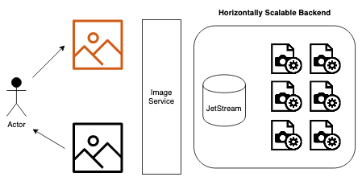
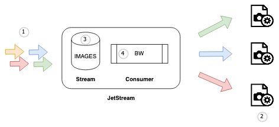

# JetStream Work Queues

In this document we demonstrate an end to end example of a typical Work Queue using Jetstream. We will use Go and Ruby
to implement the solution in order to show how JetStream can be used from any existing NATS client.

The Work Queues will be pre-created using the `nats` CLI.

## Background

We will make a small image processing pipeline that converts images into Black and White. 



The Service will have a backend that is horizontally scalable and communicates via JetStream. In this walkthrough we'll
show only the backend.

 * Image conversion requests will enter via NATS requests on `IMAGE.>`
 * Requests will be stored in JetStream and removed once processed
 * Image conversion workers will be horizontally scalable
 * Images will be stored in a shared storage like NFS, a S3 bucket or similar
 


 1. Requests for image processing enter on the NATS subject `IMAGE.blackandwhite` using the NATS Request pattern
 2. Image converters read work requests using NATS Request pattern
 3. Requests are stored in a Stream called `IMAGES` that is configured for Work Queue Retention
 4. Requests are presented to NATS clients using a Consumer called `BW` that tracks what work was completed

## Work Requests

As mentioned above we will store the incoming image that needs to be converted on disk and the workers will access it
there.  We do not send the actual image over NATS only a request to perform the modification.

To do this we'll publish JSON messages like this:

```json
{
  "id": "5e91425fc89dac47f6d2e95d4cf6b74a",
  "image": "file:///data/work/5e91425fc89dac47f6d2e95d4cf6b74a.jpg",
  "advisory": "advisory.5e91425fc89dac47f6d2e95d4cf6b74a"  
}
```

The individual workers will load this file, convert it to B&W and save it in an output location, we'll inform other
processes that the conversion is done by publishing an event on success to the target in `advisory`:

On success:

```json
{
  "id": "5e91425fc89dac47f6d2e95d4cf6b74a"
}
```

## Configure JetStream

We'll pre-configure JetStream to simplify the individual workers, this is typical in Work Queue scenarios where the
JetStream components can be seen as a piece of infrastructure that should be preconfigured prior to deployment of the
various micro services that does the work.

### Stream

First we define our stream, it will listen on a standard NATS wildcard subject `IMAGES.>` for new messages and store
them on disk.

We choose the Work Queue Retention scheme that will ensure a message is deleted from the stream as soon as any worker
has completed processing it.

We keep an unlimited amount of messages but enforce a maximum size of `512` bytes per message.

```nohighlight
$ nats stream add IMAGES 
   --subjects "IMAGES.>" 
   --retention work 
   --storage file 
   --discard old 
   --max-msgs=-1 
   --max-bytes=-1 
   --max-age=-1 
   --max-msg-size=512 
   --dupe-window 1h
```

### Consumer

Next we make the consumer, this is a Pull consumer and we give image converters up to 30 seconds to do the conversion.

We require that every message is individually acknowledged and we protect the consumers from images that crash them
by ensuring each message is only tried maximum of 5 times.

The Stream listens on `IMAGES.>` to cater for different kind of converters, this is the Black and White converter so 
we filter the stream for only messages that arrived on `IMAGES.blackandwhite`.

```nohighlight
$ nats consumer add IMAGES BW 
    --max-deliver=5 
    --pull 
    --wait=30s 
    --ack=explicit 
    --replay=instant 
    --deliver all 
    --filter="IMAGES.blackandwhite"
```

## Image Converts

Our image converters are normal NATS clients using existing core NATS client libraries. They Request their work using
the Next Subject for the `BW` Consumer which will be `$JS.API.CONSUMER.MSG.NEXT.IMAGES.BW` and acknowledge using the
normal Respond method.

We can publish requests using the CLI to test these, pick a color image and fill it into the message below:

```nohighlight
$ mkdir -p /tmp/images/{input,output}
$ cp color.jpg /tmp/images/input/color.jpg
$ echo '{"id":"5e91425fc89dac47f6d2e95d4cf6b74a", "image":"file:///tmp/images/input/color.jpg"}'|nats req IMAGES.blackandwhite
```


### Go

The Golang code for a worker is attached, it uses only the core NATS client to interact with JetStream and calls the
ImageMagick command `convert` to do the conversion.

It is configurable via environment variables and will exit on any error as is typical for 12 factor style applications.

```nohighlight
$ NATS_URL=localhost OUTDIR=/tmp/images/output ./bw
2020/07/22 12:41:30 Looking for a B&W conversion job
2020/07/22 12:41:31 Processing &main.Job{ID:"5e91425fc89dac47f6d2e95d4cf6b74a", URI:"file:///tmp/images/input/color.jpg"}
2020/07/22 12:41:31 Converting /tmp/images/input/color.jpg into /tmp/images/output/5e91425fc89dac47f6d2e95d4cf6b74a.jpg
2020/07/22 12:41:32 Looking for a B&W conversion job
```

```go
package main

import (
	"context"
	"encoding/json"
	"fmt"
	"log"
	"net/url"
	"os"
	"os/exec"
	"path/filepath"
	"time"

	"github.com/nats-io/nats.go"
)

// Job is the request to convert an image
type Job struct {
	ID       string `json:"id"`
	URI      string `json:"image"`
	Advisory string `json:"advisory"`
}

// Advisory is an advisory published to notify others that an image is done
type Advisory struct {
	ID string `json:"id"`
}

func panicIfError(err error) {
	if err == nil {
		return
	}

	panic(err)
}

func convertMessage(job *Job, outDir string) error {
	uri, err := url.Parse(job.URI)
	panicIfError(err)

	// timeout the command after 30 seconds
	ctx, cancel := context.WithTimeout(context.Background(), 30*time.Second)
	defer cancel()

	outfile := filepath.Join(outDir, fmt.Sprintf("%s%s", job.ID, filepath.Ext(uri.Path)))
	log.Printf("Converting %s into %s", uri.Path, outfile)

	// use ImageMagick to convert the image
	convert := exec.CommandContext(ctx, "/bin/convert", "-monochrome", uri.Path, outfile)
	return convert.Run()
}

func publishAdvisory(id string, target string, nc *nats.Conn) error {
	// Publish an advisory to IMAGES.advisory
	advisory := &Advisory{id}
	advj, err := json.Marshal(advisory)
	if err != nil {
		return err
	}

	return nc.Publish(target, advj)
}

func processNextMessage(nc *nats.Conn, outDir string) error {
	log.Printf("Looking for a B&W conversion job")

	// Load the next message from the IMAGES stream BW consumer
	msg, err := nc.Request("$JS.API.CONSUMER.MSG.NEXT.IMAGES.BW", []byte(""), time.Minute)
	// ErrTimeout means there is no new message now lets just skip
	if err == nats.ErrTimeout {
		return nil
	}
	if err != nil {
		return err
	}

	// Parse the job
	job := &Job{}
	err = json.Unmarshal(msg.Data, job)
	if err != nil {
		return err
	}

	log.Printf("Processing %#v", job)

	// Process the image into B&W
	err = convertMessage(job, outDir)
	if err != nil {
		return err
	}

	// Advise that it was completed
	if job.Advisory != "" {
		err = publishAdvisory(job.ID, job.Advisory, nc)
		if err != nil {
			return err
		}
	}

	// Acknowledge the message in JetStream, this will delete it from the work queue
	return msg.Respond(nil)
}

func main() {
	nc, err := nats.Connect(os.Getenv("NATS_URL"), nats.ErrorHandler(func(_ *nats.Conn, _ *nats.Subscription, err error) {
		panic(err)
	}))
	panicIfError(err)

	outDir := os.Getenv("OUTDIR")
	if outDir == "" {
		panic("Please set OUTDIR")
	}

	for {
		err = processNextMessage(nc, outDir)
		panicIfError(err)
	}
}
```

### Ruby

The Ruby code is pretty much a straight port of the Go code and you can run both at the same time, they'll spread the work.

```nohighlight
$ NATS_URL=localhost OUTDIR=/tmp/images/output ./bw
I, [2020-07-22T14:56:33.694467 #25151]  INFO -- : Looking for a B&W conversion job
I, [2020-07-22T14:56:35.519974 #25151]  INFO -- : Processing {"id"=>"5e91425fc89dac47f6d2e95d4cf6b74a", "image"=>"file:///tmp/images/input/color.jpg"}
I, [2020-07-22T14:56:35.520022 #25151]  INFO -- : Converting /home/rip/IMG_8571-mini.jpg into /tmp/images/output/5e91425fc89dac47f6d2e95d4cf6b74a.jpg
I, [2020-07-22T14:56:35.685606 #25151]  INFO -- : Looking for a B&W conversion job
```

```ruby
#!/bin/env ruby

require 'nats/io/client'
require 'logger'
require 'uri'
require 'timeout'
require 'pp'

@logger = Logger.new(STDOUT)

def convertimg(job, output)
  Timeout.timeout(30) do
    uri = URI(job["image"])

    @logger.info("Processing %s" % job.inspect)

    out = File.join(output, "%s%s" % [job["id"], File.extname(uri.path)])

    @logger.info("Converting %s into %s" % [uri.path, out])
    system("/bin/convert", "-monochrome", uri.path, out) || raise("convert failed")
  end
end

def process(nc, output)
  @logger.info("Looking for a B&W conversion job")

  begin
    msg = nc.old_request("$JS.API.CONSUMER.MSG.NEXT.IMAGES.BW", "", timeout: 30)
  rescue NATS::IO::Timeout
    return
  end

  job = JSON.parse(msg.data)

  convertimg(job, output)

  nc.publish(job["advisory"], {"id" => job["id"]}.to_json) if job["advisory"]

  nc.publish(msg.reply, "")
end

nats = NATS::IO::Client.new

nats.connect(ENV.fetch("NATS_URL", "localhost"))

out_dir = ENV["OUTDIR"] || abort("Please set OUTDIR")

while true
  process(nats, out_dir)
end
```

## Delivery Attempts Exceeded

We configured the Consumer to only attempt 5 deliveries, JetStream will publish an advisory when this is exceeded.

```nohighlight
$ nats event --js-advisory
Listening for Advisories on $JS.EVENT.ADVISORY.>

[13:21:08] [0E6Ka0thJ4ISGtcFEatgiR] Delivery Attempts Exceeded

          Consumer: IMAGES > BW
   Stream Sequence: 121
        Deliveries: 5
```

To force a failure publish a message with just `{}` in it's body - or any invalid JSON - the worker will crash, after
5 crashed you should see the event above.

The message will stay in the Stream, you can inspect it using:

```nohighlight
$ nats str get IMAGES 121
Item: IMAGES#121 received 2020-07-22 15:18:30.016124133 +0200 CEST on Subject IMAGES.blackandwhite

{}
```
